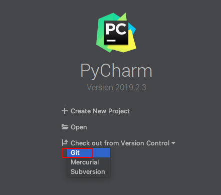

# 一、Python开发环境搭建
## 1. 软件安装
1. 安装3.6.5版本 或直接安装 Anaconda（建议），科学计算的各种包都包含了，方便进行虚拟环境搭建
2. mac 安装 minconda3
3. 安装Pycharm
4. 搭建虚拟环境
5. 使用conda或pip安装软件包
## 2. 虚拟环境的搭建
	打开终端，conda list 查看；
	//下面是创建python=3.6版本的环境，取名叫py36
	conda create -n py36 python=3.6.9 
	删除环境（不要乱删啊啊啊）
	conda remove -n py36 --all
	激活环境
	conda info -e 查看已按照环境
	//下面这个py36是个环境名
	source activate py36 （Mac 用此命令）
	 conda activate py36 （Windows 用此命令）
	退出环境
	source deactivate

## 3.pip 安装Python模块
    安装pyqt5时使用命令：
        pip install pyqt5
        一直因为网络问题无法正确下载。
        然后网上搜了一下，换用了这个命令：
        pip install PyQt5 -i https://pypi.douban.com/simple
        同理 安装pyqt5-tools：
        pip install PyQt5-tools -i http://pypi.douban.com/simple --trusted-host=pypi.douban.com
        解决。
        pip install PyQt5-tools -i http://mirrors.aliyun.com/pypi/simple/ --trusted-host=mirrors.aliyun.com
## 4.更改Python更新源为国内源
	常见的国内源：
	清华：https://pypi.tuna.tsinghua.edu.cn/simple
	阿里云：http://mirrors.aliyun.com/pypi/simple/
	中国科技大学 https://pypi.mirrors.ustc.edu.cn/simple/
	豆瓣：http://pypi.douban.com/simple/
	在Linux系统中，修改~/.pip/pip.conf文件；在Windows系统中，修改C:\Users\XXX\pip\pip.ini文件。如果没有上述文件，需要手动建立。
	在文件中输入以下内容：
	[global]
    index-url = https://pypi.mirrors.ustc.edu.cn/simple/
    [install]
    trusted-host = mirrors.ustc.edu.cn
## 5.Mac OS系统下安装Xcode Command Line Tools
    打开终端， xcode-select --install
## 6.安装homebrew
	/usr/bin/ruby -e "$(curl -fsSL https://raw.githubusercontent.com/Homebrew/install/master/install)"
	
	常用命令:
	brew --help: 帮助
	brew install wget: 安装wget包(Homebrew 会将软件包安装到独立目录, 并将其文件软链接至 /usr/local).
	brew search mysql: 搜索.
	brew info mysql: 主要看具体的信息. 比如目前的版本, 依赖, 安装后注意事项等.
	brew update: 更新Homebrew.
	brew outdated: 列出所有安装包里可以升级的包.
	brew upgrade: 升级所有可以升级包.
	brew cleanup: 清理不需要的版本极其安装包缓存.
	brew reinstall mysql: 重新覆盖安装包.
	brew uninstall mysql: 卸载
    brew doctor: 检查有没有问题
## 7.Git设置	
1. 首先在GitHub创建一个Python库，然后
2. command+k ，提交到本地
3. command+shift+k ，push到GitHub
4. 选择文件夹，提交并push，就可以在GitHub网站看到了
5. github上的版本和本地版本冲突的解决方法
    git push -u origin master -f

至此，可以开心的在安装环境中进行Python学习了

