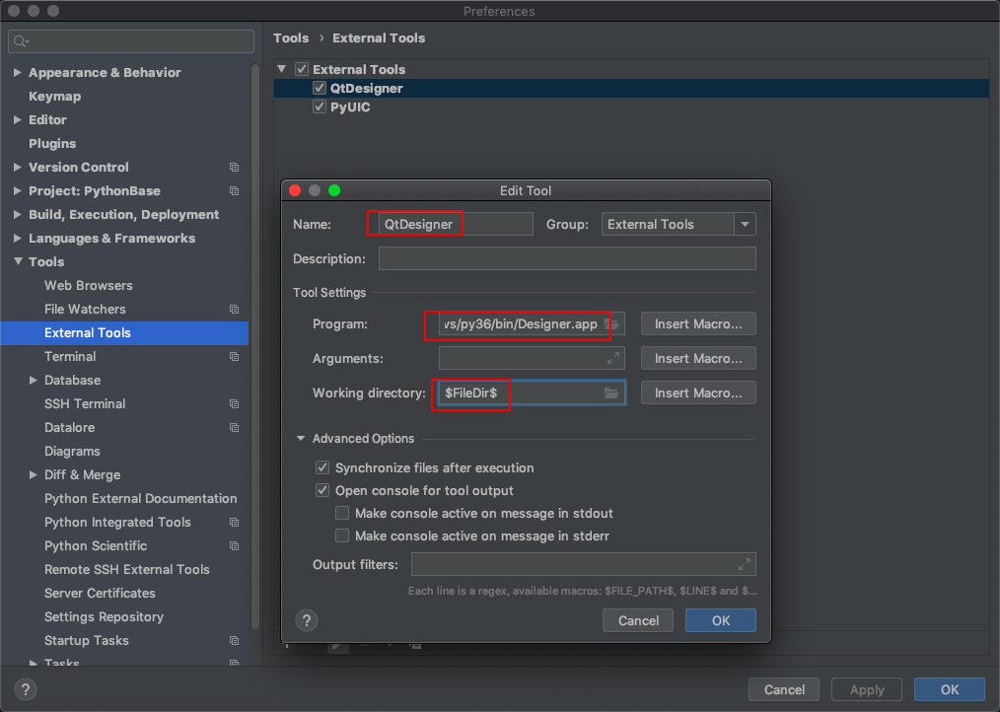
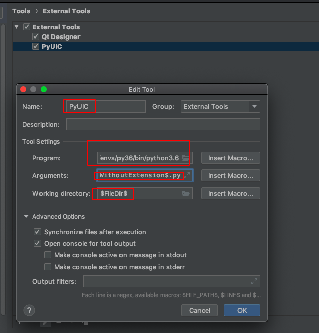
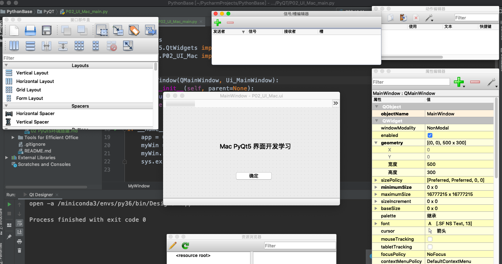

# 02 PyQt5环境搭建
## 1.安装PyQt5
    pip install pyqt5
    pip install PyQt5-tools (windows需要安装这个，Mac不用)
## 2. Qt designer图形界面mac配置
### Qt Designer配置
  打开 pycharm->preference
  找到tools->External Tools，点击➕号新增，如下图所示

    Qt Designer
    /miniconda3/envs/py36/bin/Designer.app
    $FileDir$
### PyUIc配置：
    program  自己的路径，不要选错:/Users/liuchen/PycharmProjects/spiderM/venv/bin/python
    这其实就是在命令行中运行就可以的 -m PyQt5.uic.pyuic $FileName$ -o $FileNameWithoutExtension$.py
    $FileDir$ 固定不变

## 3. Qt designer图形界面Windows配置

## 4. Qt designer使用流程
  新建GUI图形界面，如下图：

  创建的UI文件转换成py文件
  编写主程序，调用图形界面，如下所示。
  参考代码路径：PyQT/P02_UI_Mac_main.py
   
    import sys
    from PyQt5.QtWidgets import QApplication, QMainWindow
    from PyQT.P02_UI_Mac import *
    
    
    class MyWindow(QMainWindow, Ui_MainWindow):
        def __init__(self, parent=None):
            super(MyWindow, self).__init__(parent)
            self.setupUi(self)
    
    
    if __name__ == '__main__':
        app = QApplication(sys.argv)
        myWin = MyWindow()
        myWin.show()
        sys.exit(app.exec_())
#
