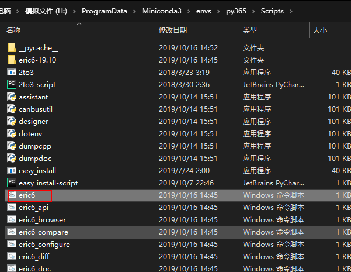
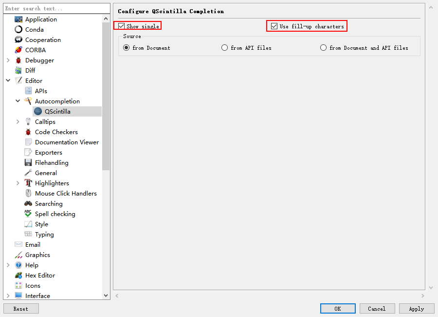

# 一、Python开发环境搭建
## 1.1 软件安装
1. 安装3.6.5版本 或直接安装 Anaconda（建议），科学计算的各种包都包含了，方便进行虚拟环境搭建

2. mac 安装 minconda3

3. 安装Pycharm

4. 搭建虚拟环境

5. 使用conda或pip安装软件包

6. 本教程使用Typora作为Markdown编辑器，设置图片保存如下：

   
## 1.2 虚拟环境的搭建
	打开终端，conda list 查看；
	//下面是创建python=3.6版本的环境，取名叫py36
	conda create -n py36 python=3.6.9 
	删除环境（不要乱删啊啊啊）
	conda remove -n py36 --all
	激活环境
	conda info -e 查看已按照环境
	//下面这个py36是个环境名
	source activate py36 （Mac 用此命令）
	 conda activate py36 （Windows 用此命令）
	退出环境
	source deactivate （Windows 用此命令）
	conda deactivate （Mac 用此命令）

## 1.3Python模块安装

### 1.3.1pip安装

    安装pyqt5时使用命令：
        pip install pyqt5
        一直因为网络问题无法正确下载。
        然后网上搜了一下，换用了这个命令：
        pip install PyQt5 -i https://pypi.douban.com/simple
        同理 安装pyqt5-tools：
        pip install PyQt5-tools -i http://pypi.douban.com/simple --trusted-host=pypi.douban.com
        解决。
        pip install PyQt5-tools -i http://mirrors.aliyun.com/pypi/simple/ --trusted-host=mirrors.aliyun.com
        安装制定版本的模块包
        pip install SomePackage==1.0.4    # specific version
### 1.3.2手动安装

有时候pip安装python包会失败，提示   未找到和环境相匹配的包。可以试试手动安装。

对于手动安装python包，比如chardet，需要下载解压后放到 Lib->site-packages下面（python安装目录下好像也可以，没放过。site-packages是放第三方包的），然后再chardet的目录下有个setup.py，需要在这个目录下打开命令行，运行python setup.py install 完成编译。这样就完成安装了。

## 1.4更改Python更新源为国内源

	常见的国内源：
	清华：https://pypi.tuna.tsinghua.edu.cn/simple
	阿里云：http://mirrors.aliyun.com/pypi/simple/
	中国科技大学 https://pypi.mirrors.ustc.edu.cn/simple/
	豆瓣：http://pypi.douban.com/simple/
	在Linux系统中，修改~/.pip/pip.conf文件；在Windows系统中，修改C:\Users\XXX\pip\pip.ini文件。如果没有上述文件，需要手动建立。
	在文件中输入以下内容：
	[global]
	index-url = https://pypi.mirrors.ustc.edu.cn/simple/
	[install]
	trusted-host = mirrors.ustc.edu.cn
## 1.5Mac OS系统下安装Xcode Command Line Tools
    打开终端， xcode-select --install
## 1.6安装homebrew
```python
/usr/bin/ruby -e "$(curl -fsSL https://raw.githubusercontent.com/Homebrew/install/master/install)"

常用命令:
brew --help: 帮助
brew install wget: 安装wget包(Homebrew 会将软件包安装到独立目录, 并将其文件软链接至 /usr/local).
brew search mysql: 搜索.
brew info mysql: 主要看具体的信息. 比如目前的版本, 依赖, 安装后注意事项等.
brew update: 更新Homebrew.
brew outdated: 列出所有安装包里可以升级的包.
brew upgrade: 升级所有可以升级包.
brew cleanup: 清理不需要的版本极其安装包缓存.
brew reinstall mysql: 重新覆盖安装包.
brew uninstall mysql: 卸载
brew doctor: 检查有没有问题
```
## 1.7Git设置	
1. 首先在GitHub创建一个Python库，然后
2. command+k ，提交到本地
3. command+shift+k ，push到GitHub
4. 选择文件夹，提交并push，就可以在GitHub网站看到了
5. github上的版本和本地版本冲突的解决方法
    git push -u origin master -f


## 1.8PyCharm设置

### 1.8.1设置代码模板

```
#!//miniconda3/envs/py36/bin/
# -*- coding: UTF-8 -*-
"""
@author: YaoLei
@license: (C) Copyright 2011-2019.
@contact: yaoleistable@gmail.com
@software: Lei
@file: ${NAME}.py
@time: ${DATE} ${TIME}
"""
```


### 1.8.2Pycharm不自动打开最近项目，显示项目列表

目标： Pycharm如何不自动打开最近项目，显示项目列表。

  路径：File->settings->system settings->startup->reopen lase project on startup。

  操作：勾掉"reopen lase project on startup"，然后，点击【Apply】或【OK】即可！


### 1.8.3PyCharm插件安装

- **.ignore插件**

  设置里面选择插件，搜索，安装，重启


- 创建合适的忽略文件


### 1.8.4快捷键

- **注释**： 代码选中的条件下，同时按住
  Ctrl+/，被选中行被注释，再次按下Ctrl+/，注释被取消

至此，可以开心的在安装环境中进行Python学习了

# 二、 PyQt5环境搭建

## 2.1安装PyQt5

```python
pip install pyqt5
pip install PyQt5-tools (windows需要安装这个，Mac不用)
```

## 2.2 Qt designer图形界面mac配置

### 2.2.1Qt Designer配置

  打开 pycharm->preference
  找到tools->External Tools，点击➕号新增，如下图所示

    Qt Designer
    /miniconda3/envs/py36/bin/Designer.app
    $FileDir$

### 2.2.2PyUIC配置：

```
program  自己的路径，不要选错:/Users/liuchen/PycharmProjects/spiderM/venv/bin/python
这其实就是在命令行中运行就可以的 -m PyQt5.uic.pyuic $FileName$ -o $FileNameWithoutExtension$.py
$FileDir$ 固定不变
```


### 2.2.3PyRcc配置

pyrcc用于PyQt5的资源文件转码。具体配置与上述内容相同，Arguments填入：

>Program:H:\ProgramData\Miniconda3\envs\py36\Scripts\pyrcc5.exe
>
>Argumennts: $FileName$ -o $FileNameWithoutExtension$_rc.py
>
>Working directory:$FileDir


## 2.3 Qt designer图形界面Windows配置

  比较简单，百度搜索即可，可参考网址：https://www.jianshu.com/p/51b19e726f50

## 2.4 Qt designer使用流程

  新建GUI图形界面，如下图：

  创建的UI文件转换成py文件
  编写主程序，调用图形界面，如下所示。
  参考代码路径：PyQT/P02_UI_Mac_main.py

```python
import sys
from PyQt5.QtWidgets import QApplication, QMainWindow
from PyQT.P02_UI_Mac import *

class MyWindow(QMainWindow, Ui_MainWindow):
    def __init__(self, parent=None):
        super(MyWindow, self).__init__(parent)
        self.setupUi(self)
if __name__ == '__main__':
    app = QApplication(sys.argv)
    myWin = MyWindow()
    myWin.show()
    sys.exit(app.exec_())
```

##   2.5 Eric 安装

Eric是一个完整的Python编辑器和IDE，用Python编写。它是基于跨平台QT-UI工具包，集成了高度灵活的闪烁编辑器控件。它被设计成可用作为“每日”的快速和肮脏的编辑器，以及作为一个集成了许多先进特性的专业项目管理工具，Python提供专业编码器。EIC包括插件系统，它允许IDE功能的简单扩展，插件可以从网络下载。

用 Eric6 与 PyQt5 结合，非常方便的实现界面与逻辑分离，满足python的极速GUI编程，不需要在界面上花很多时间。

### 2.5.1Mac下安装

使用conda创建Python3.7.4（3.5版本以上都可以）版本，依次下载好安装PyQt5-5.13.1、QScintilla-2.11.2、PyQtChart-5.13.0、PyQtWebEngine-5.13.1、eric6-19.8，进行安装。

用pycharm安装Jupyter后，Designer会自动安装好。

```
conda activate pythonbase
pip install PyQt5-5.10-5.10.0-cp35.cp36.cp37-abi3-macosx_10_6_intel.whl
pip install QScintilla-2.10.2-5.9.3-cp35.cp36.cp37-abi3-macosx_10_6_intel.whl

(pythonbase) yaoleideMacBook-Air:plugin yaolei$ cd eric6-19.8
(pythonbase) yaoleideMacBook-Air:eric6-19.8 yaolei$ python install.py
Checking dependencies
Python Version: 3.7.4
Found PyQt5
Found pyuic5
Found QScintilla2
Found QtGui
Found QtNetwork
Found QtPrintSupport
Found QtSql
Found QtSvg
Found QtWidgets
Found QtWebEngineWidgets
Qt Version: 5.10.0
sip Version: 4.19.8
PyQt Version: 5.10
QScintilla Version: 2.10.2
All dependencies ok.

Cleaning up old installation ...

Creating configuration file ...

Compiling user interface files ...

Compiling source files ...

Installing eric6 ...
Installing Python API files to '//miniconda3/envs/pythonbase/lib/python3.7/site-packages/PyQt5/Qt/qsci/api/python'.
Installing Ruby API files to '//miniconda3/envs/pythonbase/lib/python3.7/site-packages/PyQt5/Qt/qsci/api/ruby'.
Installing QSS API files to '//miniconda3/envs/pythonbase/lib/python3.7/site-packages/PyQt5/Qt/qsci/api/qss'.

Installation complete.
```

```
安装成功后的包文件：
(pythonbase) yaoleideMacBook-Air:eric6-19.8 yaolei$ pip list
Package    Version  
---------- ---------
certifi    2019.9.11
packaging  19.2     
pip        19.2.3   
pyparsing  2.4.2    
PyQt5      5.10     
QScintilla 2.10.2   
setuptools 41.4.0   
sip        4.19.8   
six        1.12.0   
toml       0.10.0   
wheel      0.33.6 
```


```
Found QScintilla2
Found QtGui
Found QtNetwork
Found QtPrintSupport
Found QtSql
Found QtSvg
Found QtWidgets
Found QtWebEngineWidgets
Qt Version: 5.9.7
sip Version: 4.19.8
PyQt Version: 5.9.2
QScintilla Version: 2.10.2
All dependencies ok.
```

安装成功后，在终端输入虚拟环境， eric6 启动程序


###   2.5.2 Windows下安装Eric

> 建议严格按照如下顺序安装软件，才能保证安装成功
>
> 如果环境已安装PyQt5、QScintilla、sip，则卸载，如pip unintall pyqt5
>
> **建议以下安装包都离线下载好**，采用离线方式安装，避免网速不佳造成安装失败。
>
> **版本选择：Python3.6及以上、PyQt5==5.10.1 、pyqt5-tools==5.10.1.1.3、eric6-17.03.1中文版**（经测试，这个版本比较稳定，其他高版本会出现各种对应包不全引起的问题）

```
(py365) H:\ProgramData\Miniconda3\envs\py365\Scripts\eric6-17.03.1>python install.py
Checking dependencies
Python Version: 3.6.5
Found PyQt5
Found pyuic5
Found QScintilla2
Found QtGui
Found QtNetwork
Found QtPrintSupport
Found QtSql
Found QtSvg
Found QtWidgets
Qt Version: 5.10.1
sip Version: 4.19.8
PyQt Version: 5.10.1
QScintilla Version: 2.10
```


1. **安装Python虚拟环境**

   ```
   conda activate -n py364 python=3.6.4
   conda activate py364  # 激活工作环境
   ```

2. **安装SIP**

   SIP是安装PyQt5的前提条件，所以先安装这个

   ```
   pip install SIP
   ```

3. 安装PyQtWebEngine（Eric6-18版本以上需要）

   ```
   pip install PyQtWebEngine
   ```

   如网速不佳，下载后安装，<https://pypi.org/project/PyQtWebEngine/>下载放入H:\ProgramData\Miniconda3\envs\py364\Scripts>文件夹，切换到文件夹后安装

   ```
   (py364) H:\ProgramData\Miniconda3\envs\py364\Scripts>
   pip install PyQtWebEngine-5.13.1-5.13.1-cp35.cp36.cp37.cp38-none-win_amd64.whl
   ```

4. **安装PyQt5**

   ```
   pip install PyQt5==5.10.1 -i https://pypi.douban.com/simple
   ```

   离线下载地址：<https://pypi.org/project/PyQt5/5.10.1/#history>

5. **安装QScintilla**

   Eric6也需要这个，安装

   ```
   pip install QScintilla==2.10
   ```

   离线下载中地址：<https://pypi.org/project/QScintilla/#history>

6. **安装PyQt5-tools**

   

   ```
   pip install pyqt5-tools==5.10.1.1.3
   
   pip install PyQt5-tools==5.10.1.1.3 -i http://pypi.douban.com/simple --trusted-host=pypi.douban.com
   ```

   离线下载地址：<https://pypi.org/project/pyqt5-tools/#history>

7. 安装PyQtChart（Eric6-18版本以上需要）

   PyQtChart下载地址：<https://pypi.org/project/PyQtChart>

   ```
   pip install PyQtChart
   ```

   

8. 安装pywin32（Eric6-18版本以上需要）

   pywin32下载地址：<https://pypi.org/project/pywin32>

   ```
   pip install pywin32
   ```

   

9. **安装Eric6**

   下载Eric6，<http://eric-ide.python-projects.org/eric-download.html>，切换到目录后安装

   ```
   (py364) G:\Code\Python\eric6-18.05>python install.py
   ```

   安装以上所有后，pip list 查看版本：

   ```
   (py365) H:\ProgramData\Miniconda3\envs\py365\Scripts\eric6-17.03.1>pip list
   Package       Version
   ------------- ----------
   certifi       2019.9.11
   Click         7.0
   packaging     19.2
   pip           19.2.3
   pyparsing     2.4.2
   PyQt5         5.10.1
   PyQt5-sip     12.7.0
   pyqt5-tools   5.10.1.1.3
   python-dotenv 0.10.3
   pywin32       225
   QScintilla    2.10
   setuptools    41.4.0
   sip           4.19.8
   six           1.12.0
   toml          0.10.0
   wheel         0.33.6
   wincertstore  0.2
   ```

   

10. **配置Eric6**

    双击eric6.bat，启动Eric软件，或在命令行输入eric6启动

    

    启动界面如下：

    

## 2.6 Eric设置

### 2.6.1代码补全的设置

若安装了QScintilla，Eric6就具有代码提示（Calltips）和补全（Autocompletion）功能，在设置里可以设置代码提示和补全功能，设置界面如下图。




### 2.6.2 添加PyQt5-tools添加到环境变量

H:\ProgramData\Miniconda3\envs\py365\Lib\site-packages\pyqt5_tools\Qt\bin


### 2.6.3 配置PyQt5-tools路径

H:\ProgramData\Miniconda3\envs\py365\Lib\site-packages\PyQt5\Qt\translations

H:\ProgramData\Miniconda3\envs\py365\Lib\site-packages\pyqt5_tools\Qt\bin


### 2.6.4 其他配置

配置导入编译API：


配置编码：


配置工作路径：


代码自动补全插件安装：

进入插件仓库，选择安装Jedi


然后新建工程，就可以愉快的玩耍Python了

可参考文章[使用Eric新建Python GUI项目](https://blog.csdn.net/rock4you/article/details/51249033)

开发流程：在Eric下双击ui文件，在Qt设计师内设计GUI界面，然后保存，接着到Eric下，将ui文件右键进行编译，最后切换到python栏下，点击运行即可看到窗口。
1、新建工程文件
2、新建UI窗体，选择Main Window然后生成UI，接着会自动转入Qt设计师界面
3、然后UI右键选择Compile form，转为py文件
4、接着切回python栏，点击Start栏选择run(或者F2)运行程序即可。
5、ui文件右键选择调用函数(第三个，以后就不用点击)，会自动生成新得py文件，然后再最下边添加主程序后，运行即可。

# 三、PyQt学习图形GUI设计

## 3.1标签Label学习


